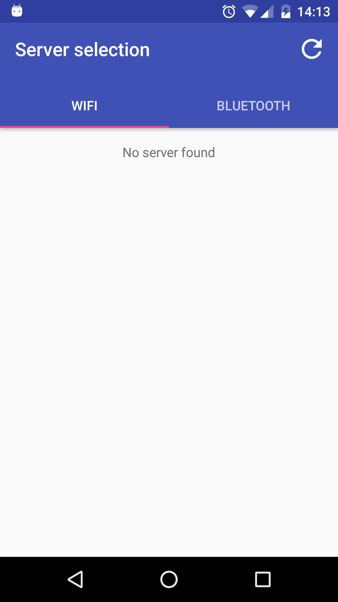
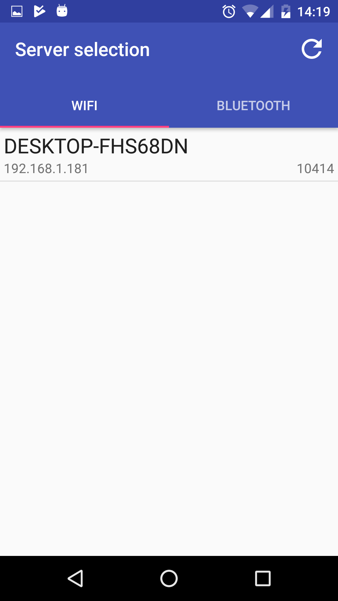
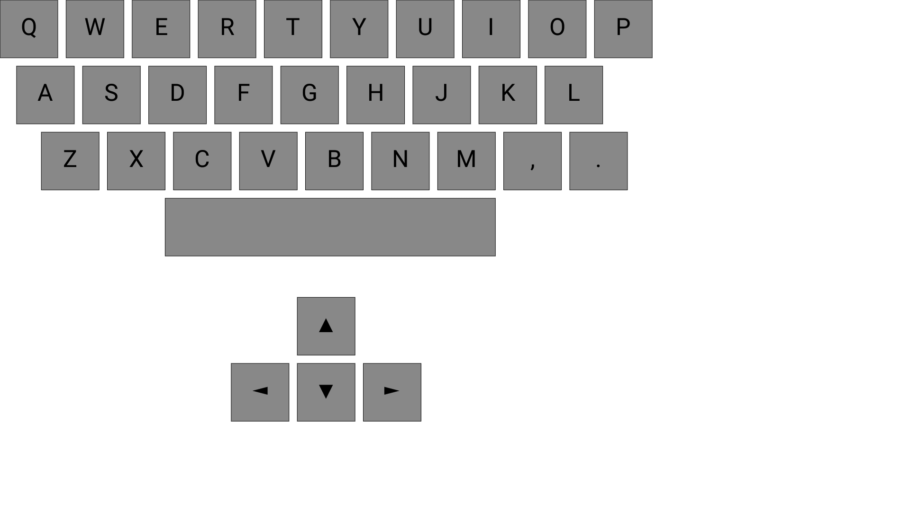

 

    

# MacroKeys Android Client &middot;  

Android MacroKeys client.

## Features

- Send the macro at the server [Desktop App](https://github.com/SimoneCorazza/MacroKeysServer)
- Communicate with Bluetooth and Wifi
- Customize your keyboards with the [editor](https://github.com/SimoneCorazza/MacroKeysEditor)
- Trace every keystroke sent
- Encrypted protocol for added layer of security

## How To Use

1. Install the server [Desktop App](https://github.com/SimoneCorazza/MacroKeysServer), the [editor](https://github.com/SimoneCorazza/MacroKeysEditor) and this **Android App**
1. Create a MacroKeys using the **editor**
4. Connect the **client app** to the **server** (using Bluetooth or Wifi)
5. Start sending keystrokes to the server

## Getting Started

Use [Android Studio](https://developer.android.com/studio) to build the project
